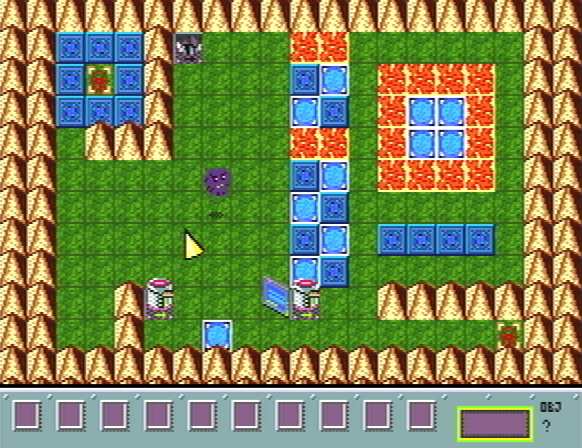

# dweep-gen
Version of old Dweep shareware game on Sega Genesis (using SGDK)

## About

This is a SGDK port of the old shareware game Dweep.
Not much to talk about for now, still in the beginning.
Next major milestones would be:
+ ~~A* navigation for Dweep~~
+ ~~Collision with walls and objs~~
+ Lasers
+ Some items and inventory
+ Player States
+ Game states (victory, defeat)
+ Menu

Music was converted using libOPNMIDI (midi2vgm). Still needs some manual adjustment.
SFX was imported straight from the original game.
Art uses LibreSprite for tilesets and sprites, and Tiled for tilemaps.

The original Dweep was created and programmed by Steve Pavlina, with music by Michael Huang.

## Building

~~Should not be different to build than any other SGDK project.~~ **(Curretly needs a patched version of rescomp for reading object dimensions, will submit a PR at some point.)** After [installing the toolchain](https://github.com/Stephane-D/SGDK/wiki/SGDK-Installation),
check the [usage documentation](https://github.com/Stephane-D/SGDK/wiki/SGDK-Usage).

