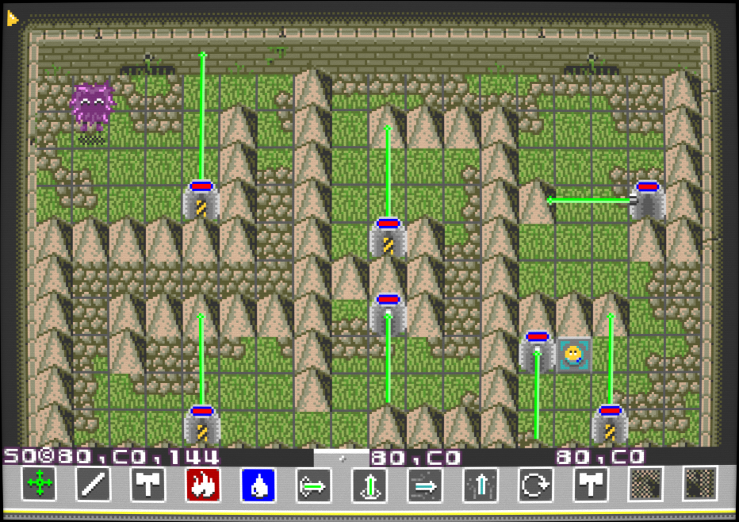

# Troublob

[](https://jenkins.camargo.eng.br/job/troublob/)

A puzzle game for the Sega MegaDrive.
This was started as a demake of [Dweep](https://en.wikipedia.org/wiki/Dweep).

<!---->

## About

(To be filled-in, project is being restructured as an original game).

<!--ENGBR_SECTION
## Try it Out

You can try the latest build, with debug enabled, running in an emulator in your browser.

Mouse support is enabled, and mouse will be captured on first init. Click to start.

**Controls:**
 + Arrow keys: move cursor
 + A: click with cursor (A button)
 + Z: previous tool (B button)
 + X: next tool (C button)
 + Enter: pause, menu, start (Start button)
 + F1: open RetroArch menu


```{nostalgistjs}
    :rom_url: "https://jenkins.camargo.eng.br/job/troublob/lastSuccessfulBuild/artifact/ci-build/out/Troublob_(latest).bin"
    :core_id: genesis_plus_gx
    {
        "nostalgist_options": {
            "retroarchConfig": {
                "video_smooth": true,
                "input_auto_mouse_grab": true
            }
        },
        "before_launch_preamble": "let efs = nostalgist.getEmscriptenFS(); efs.mkdirTree('/home/web_user/retroarch/userdata/config/remaps/Genesis Plus GX'); efs.writeFile('/home/web_user/retroarch/userdata/config/remaps/Genesis Plus GX/Dweep_Genesis_(latest).rmp',  'input_libretro_device_p1 = \"1\"\\ninput_libretro_device_p2 = \"2\"');"
    }
```
ENGBR_SECTION-->

## Download

Download the latest build [here](https://jenkins.camargo.eng.br/job/troublob/lastSuccessfulBuild/artifact/ci-build/out/Troublob_(latest).bin).


## Building

For any build method, you will need Python 3 with the `lxml` library.

### Using the CI script

This requires `docker`.
Just run `scripts/ci-build.sh`.
The output will be at `ci-build/out/rom.bin`.
Thanks to doragasu for the docker container script.

### Manually

1. Init and update git submodules (`git submodule update --init`)
2. Run the map processor script beforehand (`./scripts/process_all_maps.sh`).
3. Also run the string processor script (`./scripts/process_strings.sh`).

After this, it should not be different to build than any other SGDK project. Using version 1.90.
After [installing the toolchain](https://github.com/Stephane-D/SGDK/wiki/SGDK-Installation),
check the [usage documentation](https://github.com/Stephane-D/SGDK/wiki/SGDK-Usage).
But in general, running `make -f ${SGDK_LOCATION}/makefile.gen build` should do it.


